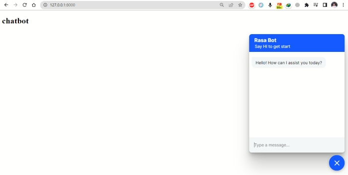

# customerCareBot
Rasa chatbot for customer support and consultancy, integration with Django website
## Chatbot for customer support and consultancy services and integration with the website.
There are several platforms available for chatbot development, but we used the Rasa framework for chatbot development and 
Django for website development. Rasa is an open framework for developing AI chatbots, while Django is a Python-based web framework. Both frameworks are open-source.
The chatbot is trained to answer basic customer questions and the FAQs are provided in a file named 'faqs.txt' in the project 
directory. You can ask the chatbot basic questions such as the company name, request help, product recommendations, password
resets, payment methods, return policies, and shipping information. Additionally, a form is available for placing orders. 
To activate the form, you can ask something like "I want to order something." The Rasa form will be activated and will
ask for details such as your name and the item you want to order, such as pizza, burger, or sandwiches.
You can also check the status of your order or cancel it by asking for the order status or canceling the order.
Here are three general steps for developing a chatbot using Rasa and integrating it with a Django website:

### Step 1:
- Create a virtual environment (optional) using the command: `python -m venv virtualEnvironmentName`
- Activate the environment using the command: `virtualEnvironmentName/Script/Activate`
- Once the virtual environment is activated, create the Django project using the command: `django-admin startproject projectName`, Here the project name is customerBot.
- Navigate to the project and create an application within the project using the command: `python manage.py startapp yourAppName`
- Set up the Django website and run it on the local machine using the command: `python manage.py runserver`. After running the
  the command kill the server by cntr+C and go to step 2.

## Step 2:
- Create a directory for the Rasa chatbot in the base directory. You can also initiate the Rasa chatbot in the base directory,
  but it may make the project structure less clear.
- Navigate to the Rasa directory by using the command: `cd rasa`
- Initialize the Rasa chatbot using the command: `rasa init --no-prompt`, This will create the initial project structure.
- Set up the chatbot according to your specific purpose. Once you have developed the chatbot, run the following command
  in the command prompt or PowerShell (make sure you are in the Rasa directory):
- `rasa run actions`. Then open another terminal to run the Rasa API core command: `rasa run -m models --enable-api --cors "*"`.
  Once these two commands run successfully, stop the server by cntr+c and go to step 3.

## step 3:
- To integrate the Rasa chatbot with the Django website, you need to make a few changes. Go to the `credentials.yml` file in the
  Rasa project and add the following code:
  ```  
  socketio:  
    user_message_evt: user_uttered  
    bot_message_evt: bot_uttered  
    session_persistence: true
  ```
- To integrate Rasa Webchat into your website copy the below script and added it into the HTML file of the application
  or visit the `official website:` https://github.com/botfront/rasa-webchat for more options and libraries.


```html
<script>
  !(function () {
    let e = document.createElement("script"),
      t = document.head || document.getElementsByTagName("head")[0];
    (e.src = "https://cdn.jsdelivr.net/npm/rasa-webchat@1.x.x/lib/index.js"),
      // Replace 1.x.x with the version that you want
      (e.async = true),
      (e.onload = () => {
        window.WebChat.default(
          {
            initPayload: '/greet',
            customData: { language: "en" },
            socketUrl: "http://localhost:5005",
            title: 'Rasa Bot',
            subtitle: 'Say Hi to get started',
            // add other props here
          },
          null
        );
      }),
      t.insertBefore(e, t.firstChild);
  })();
</script>
```  
- Make sure to change the API socketUrl to `http://localhost:5005` in the copied script. Once these changes are made,
  run the chatbot and website again. To run the Rasa chatbot, navigate to the Rasa directory in any terminal and run
  the command: "rasa run actions". Open a new terminal and run the API using the command: `rasa run -m models --enable-api --cors "*" --debug ` and then run `rasa run actions`.  
  Finally, run the Django server using the command: `python manage.py runserver` in the base directory.
- Screenshot of Rasa Chatbot is follows:

 
  

  ## 🔗 Contact:
[](https://www.linkedin.com/in/farhadmohmand66/)
[](https://twitter.com/farhadMohmand66)
[](https://wa.me/03469869529?text=)
